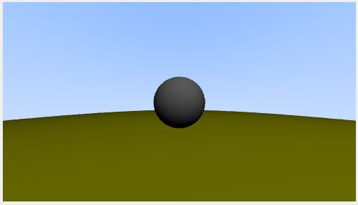
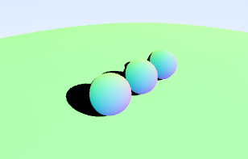
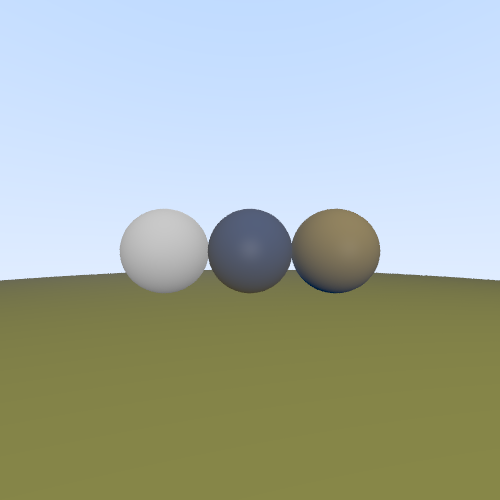

tod# RayTracingToy
Pràctica 1 - GiVD 2022-23

En aquest fitxer cal que feu l'informe de la pràctica 1.

## Equip:
**B06**
* Rubén Pacheco Cerro
* Raquel Núñez Padial
* Ronald Ortiz de Lazcano Casal
* Alex Tomás Peris

### Features (marqueu les que heu fet i qui les ha fet)
- Fase 0
    - [x] Background amb degradat
      - Rubén
    - [x] Color Shading
      - Ronald, Raquel
    - [x] Normal Shading
      - Ronald, Raquel
    - [x] Depth Shading
      - Ronald
    - [x] Intersecció amb l'escena
      - Ronald, Raquel
 - Fase 1
    - Creació de nous objectes i interseccions (VIRTUALWORLD) 
        - [x] Hit Box
          - Ronald, Alex
        - [x] Hit Triangle
          - Alex
        - [x] Hit Malla
          - Alex
    - Creació de REAL DATA
        - [x] FITTED PLANE: Pla de terra
          - Ronald
        - [x] Transformacions Translació i Escalat amb gizmos esferes
          - Ronald
        - [x] Gizmo de Box
          - Ronald
        - [x] Noves dades
          - Ronald
       
 - Fase 2
    - [x] Solucionar aliasing
      - Rubén
    - Llums puntuals
      - [x] BlinnPhongShading
        - Rubén
      - [x] PhongShading
        - Rubén, Raquel
      - [x] CelShading
        - Ronald
    - [x] Ombres
      - Alex
    - Rajos secundaris
      - [x] Recursió
        - Raquel
      - [x] Material Metal
        - Rubén
      - [x] Material Transparent
        - Rubén
    - [x] Visualization mapping 
      - Ronald
 
 - Fase 3
    - [x] Material MaterialTextura
      - Ronald
    - [x] Generar Dades i Mapes
      - Ronald

- Parts opcionales: 
  - [ ] Cilindres
   
  - [ ] Escena CSG 
  
  - [ ] Més d'una propietat en les dades reals
   
  - [ ] Mapeig de les dades reals en una esfera
  
### Preguntes
  - Fase 0:
    - b.  Quina escena es té carregada? Qui la crea? Quin setup té la classe? Des d’on es crea?
    
      La classe RayTracer té una variable setup i una variable scene, les quals són creades a la classe controller, quan el mètode es cridat per la classe builder.
    
    - c. Per què es veu aquest degradat? A quin mètode es calcula aquest color?
    
      El mètode RayPixel de la classe RayTracer calcula el color del píxel, en aquests moments fa el color depenent de la direcció del píxel.
    
    - d. Si desactives el flag de background, i tornes a fer Trace, quin efecte et trobes? Per què? Pots veure com ha arribat el flag de background al teu RayTracer? 
    
      Quan desactives el flag de background, tots els pixels es tornen negres, ja que en el mètode RayPixel es comprova que el flag abans de calcular el color, si esta desactivat, retorna el color negre. Es comprova l'estat del flag del background amb setup->getBackground().
    
    - e. En quina variable els trobes?
    
      Els colors que hi ha a la pantalla es troben a setup->getTopBackground() i setup->getDownBackground()
    
    - f. I si volguessis canviar els colors del degradat? On els canviaries?
    
      A la finestra que se'ns obre quan ens mostra la imatge, hi ha dos botons que serveix per a canviar els colors de dalt, Color Top, i el de sota, Color Bottom.
    
    - g. Si prems Trace, no la veuràs, per què?
    
      En aquests moments no s'està comprovant si el raig fa hit amb l'esfera.
    
    - h. Com hi pots accedir? A quina variable pots aconseguir l’estratègia a cridar? Com es crea aquesta estratègia des del menú? 
    
      Hem d'agafar el ShadingStrategy, per obtenir-lo utilitzem setup->getStrategy(), a la variable setup és a on es carrega la nova estratègia una vegada s'ha cridat des del menú.
    
    - i. Com faràs per a crear una nova estratègia de shading?
    
      Per a crear una nova estratègia, primer hem de crear la classe, amb el seu fitxer .cpp i .hh. Hem de tenir en compte que la classe serà una subclasse de ShadingStrategy. A part de l'interior del mètode shading, la resta del mètode és igual a la classe ColorShading.
    
    - j. Com aconsegueixes que els colors estiguin normalitzats?
    
    
    - n. Per què veus només una esfera? On està situada a la teva escena? Amb quin radi? Per què? Per què és lila i no de color "kd": [0.7,0.6,0.5] com posa el fitxer? 
      
      Només hi ha una esfera, ja que data0.json només té la informació d'una esfera. L'esfera està situada al punt [-2, 2, -1], amb un radi de 0.5, com què les coordenades x i z són fixes, i estan indicades als dos primers termes de "data", mentre que el tercer indica el radi.
      
      
 - Fase 1:
   - 3.a. Quan penses que és millor crear els triangles de la malla?
   
   - 3.b. Quina creus que teòricament és millor? Com funcionen en la realitat?
    -La comprovació d'intersecció amb una bounding sphere és considerada més eficient perquè aquestes esferes són capses que s'adapten de forma més precisa a les malles triangulars que les bounding boxes, reduint així la quantitat de càlculs necessaris per verificar si un raig interseca amb elles. En la realitat, l'eficàcia de les tècniques dependrà de diversos factors, tals com la complexitat de les malles, la precisió amb què s'hagin creat les capses contenidores i l'eficàcia dels algorismes utilitzats per detectar interseccions.
   
   - 5.c. Com calcularàs el centre del teu objecte en l'escena virtual? Com calcularàs la seva escala?
    -En primer lloc, es procedeix a calcular les distàncies entre els valors màxims i mínims dels components x i z dels objectes virtuals i reals. Després es realitza una divisió dels valors dels objectes virtuals entre els dels objectes reals per obtenir el coeficient que correspon a una unitat del món virtual en el món real. A continuació, es multipliquen aquests coeficients pel seu component corresponent al qual se li resta el valor mínim dels objectes reals, i finalment se li suma el valor mínim dels objectes virtuals. Per a l'operació de translació, s'utilitza un vector (x,0,z) on x i z són els valors obtinguts anteriorment, el qual s'aplica a través de la funció glm::translate. En quant a l'operació d'escalat, es tria la mida desitjada i s'utilitza la funció glm::scale amb el vector vec3(escala).
 
 - Fase 2:
   - Pas 1:
     - 2. On afegiries un atribut numSamples que defineixi el nombre de rajos per píxel i així controlar aquest fet?
        - Al mètode run() de la clase RayTracer ja que és on s'asigna un color a cada píxel. Per tant podríem simplement fer que run() s'executés numSamples vegades per cada píxel
     
     - 3. On faràs aquesta correcció?
        - Just abans de multiplicar per 255 el color i possar-lo al píxel pero desrpés de fer l'anti-ailasing. 
   - Pas 2:
     - 3. Què necessites canviar?
        - Hem d'afegir a la capçalera del mètode shading() com a paràmetres la llum ambient i una llista de totes les llums de l'escena. 
     
     - 4. Necessites afegir informació en el material? 
        - 
     
   - Pas 3:
     - 2. En el cas que hi hagi un objecte entre la llum i el punt on s'està calculant la il·luminació, quina component de la fórmula de Blinn-Phong s'haurà de tenir en compte?
        - La component de l'ombra.
     
   - Pas 4 (Transparencies): 
     - 2. On hauries de llegir-la?
        - A la classe Material ja que allà es on s'emmagatzemen totes les dades referents a les propietats d'aquests. 
     - 3.1. Prova-ho amb diferents nivells de recursivitat. Per què si tens el MAX_DEPTH a 1, l’esfera no es veu transparent?
        - La nostra esfera no es veu transparent mai, probablement per algun problema relacionat amb la recursivitat.
     - 3.2. Si assignes el color ambient global enlloc del de background en els rajos secundaris que no intersequen amb res. Com et canvia la visualització? Raona el per què?
        - Les zones on no intersecten els raigs aparentaran estar tallades i substituides per només una textura neutra d'una esfera grisossa. Això por set degut a que, al asignar el color ambient enlloc dels del background estem eliminant la ilusió que dona el fons pla de que la nostra esfera es completament transparent.
     
 - Fase 3:
   - Pas 1:
     - 1. S’ha calculat l’escena amb MAX_DEPTH = 10. Amb el fitxer de setup setupDataEuropa.json quina de les dues imatges obtens?
     
     - 2. Qui calcularà les coordenades (u, v) del punt d’intersecció amb el pla?
        -Les coordenades (u,v) les calcularà l'objecte que realitzi la intersecció, en el nostre cas FittedPlane.
     
     - 3.  Si a la mateixa escena d'abans es considera aquest nou material en el terra, usant el setup de setupDataEuropa.json, quina de les dues visualitzacions obtens?
     
     

    
### Explicació de la pràctica    
  * **Organització de la pràctica**
    * En un principi vam dividir les parts més grans de forma equitativa entre tots els membres del grup. Però al ser necessaries algunes coses d'apartats anteriors al final cadascú ha acabat fent una mica de tot. En el que més ens hem centrat ha sigut en fer les parts importants primer (per exemple BlinnPhong era necessari per a tota la part 2) i, una vegada fetes, intentar avançar el máxim possible en el que puguessim ja que no hem pogut coincidir en gairabé cap classe degut a factors externs.
  
### Screenshots de cada fase
* **Fase 0**: 

  - **Activitat 3**:

* **Fase 1**: 

  - **Pas 1**:

  

  - **Pas 5**:

* **Fase 2**: 
  - **Pas 1**:  
  
  - **Pas 2**:
    - **BlinnPhongShading**:  
  
  
 
 
    - **PhongShading**:  
 
 
 
 
    - **CelShading**:

  - **Pas 3**: 
    - **BlinnPhongShadow**:  
 
    - **PhongShadow**:  

    - **ColorShadow**:  
 
    - **NormalShadow**:  

    - **CellShadow**:  
 

  - **Pas 4**:

* **Fase 3**: 

  - **Pas 1**:

  - **Pas 2**:

  - **Pas 3**:
 

* **Opcionals**:

* **Més visualitzacions**:

   * Per totes les imatges, incluiu aqui la imatge obtinguda i els fitxers de dades i de configuració que heu fet servir

# Modificaciones para Reevaluación

## A Nivel de Código
* Ya se puede cambiar el numSamples por la interfaz
* Añadí flags de Reflections y Shadows en el método de read de Setup, ya se pueden cargar setups con estos flags activados

## Intersecciones
* Cambié como se añade el FittedPlane a la escena al cargar una Data Scene, antes se añadía como otro objeto, ahora se añade como basePlane y se gestiona sus intersecciones de forma diferente.
* Cambié la forma de calcular la normal del BOX ahora se comprueba si es un punto máximo o mínimo con respecto a un epsilon.

## Shading
* Cambié como se calcula la atenuación de la luz en PointLight que se hacía de forma incorrecta

### Depth
* Cambié el depth shading, eliminando calculos innecesarios que se hacían en este shading como normalizar puntos.

### BlinnPhong y Phong
* Cambié como se calculan estos shading, ya que se hacían de forma incorrecta, aplicando la atenuación solo al componete difusa y especular y teniendo en cuenta el componete ambiente y la iluminación global.

### Cel / Toon Shading
* Cambié su implementación, ya no usa una atenuación  y degrada el componente difuso para obtener una escala de colores, antes usaba una escala de colores predefinida.

## Shadows
* En los shadows de Color, Depth y Normal devuelve el componente ambiente si está en la sombra.
* Cambié como se aplica el factor sombra en BlinnPhongShadow, PhongShadow y CellShadow.

### Shadows en objetos Transparentes
* Cambié como se calcula el factor sombra para objetos transparentes en ShadingStrategy.
* Ahora se tiene en cuenta la propiedad dmax del material que reduce este factor sombra según la distancia que se atraviesa del objeto
* Cree un metodo que de forma recursiva calcula la atenuación del factor sombra de un objeto transparente, teniendo en cuenta que puede tener objetos transparentes en su interior

## RayTracer
* Ahora se hace clamp de los colores antes de la gamma corrección
* Rehice el método RayPixel, ahora si el background está desactivado el fondo es negro, no como antes que la imagen entera era negra. Ahora si se tienen en cuenta el flag de Reflection para calcular reflexiones y transparencias. Además se tiene en cuenta si el material es transparente para modificar el color.

## Escalados y Traslaciones
* Ahora la box solo escala en la Y's
* Simplifique escalado de la esfera
* Añadí escalado a los triangulos.

## Material Textura y Nuevas Escenas
* En la práctica ya existe una escena que cree yo en la cual se nos muestra un mapa de la facultat de Matematicas e Informatica de la UB, con esferas que representan las aulas de teoría y boxes para los laboratorios. Este dataset se llama DataUB.json y usa la imagen mapUB.png. Para esta nueva entrega he añadido un setupUB.json para ver mejor este dataset.
 
# Visualización de las modificaciones

## Visualizaciones de los cambios de Raytracer y Shadings
* Para las siguientes visualizaciones uso el Virtual Scene **spheresMetalTransp.json** y el setup **setupRenderOneSphere.json**. En esta escena hay 4 esfera, una esfera grande que hace de base que es Lambertian,y tres esferas pequeñas que de izquierda a derecha son de los material Transparent, Lambertian y Metal. Para estas visualizaciones uso NumSamples de 10 y MaxDepth de 4.

### Depth Shading

### Phong Shading

### Blinn Phong Shading

### Toon Shading

### Shadows
* Activo el Flag de Shadow

### Color Shadow

### Normal Shadow

### Depth Shadow

### Phong Shadow

### Blinn Phong Shadow

### Toon Shadow

### Reflections
* Activo el Flag de Reflections

### Color Shadow + Reflections

### Normal Shadow + Reflections

### Depth Shadow + Reflections

### Phong Shadow + Reflections

### Blinn Phong Shadow + Reflections

### Toon Shadow + Reflections

## Visualización de Sombras con Objetos Transparente
* Para mostrar que funciona el método del calculo de la atenuación de las sombras con objetos transparentes y que se tiene en cuenta sus objetos internos voy a usar diferentes valor de dmax.
* En las visualizaciones voy a usar el Virtual Scene **fourSpheresBubbleBaseMetal.json** y el setup **setupFourSpheresBubble.json**. Esta scena tiene 5 esferas, la esfera grande que hace base que es Metal, dos esferas medianas transparentes una dentro de la otra teniendo la externa un nut de 1 y la interna un nut de 1,5, y por último 2 esferas pequeñas una de metal y otra lambertian.
* Entre las visualizaciones iré cambiando la dmax de las esferas transparentes, refieriendome a la dmax de la esfera interna como **DI** y a la dmax de la esfera externa como **DE**.

### DI = 0 y DE = 0

### DI = 1 y DE = 1

### DI = 2 y DE = 2

### DI = 10 y DE = 10

### DI = 5 y DE = 1

### DI = 1 y DE = 2

## Visualizaciones de Escenas Reales

### Europa
* Para esta visualización voy a usar el Real Scene **dadesEuropaTextured.json** y el setup **setupDataEuropa.json**.

### UB
* Esta es la escena que he creado que es **dataUB.json** y uso el setup **setupUB.json**.
* El lookFrom esta en (2,10,2) y el lookAt en (2,0,2).

